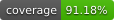

# AlchemyFace


[](https://github.com/psf/black)
[](https://www.python.org/)

Face detection and recognition built on [YuNet](https://github.com/opencv/opencv_zoo/tree/main/models/face_detection_yunet)
and [SFace](https://github.com/opencv/opencv_zoo/tree/main/models/face_recognition_sface).
Small, typed, and dependency-light: OpenCV, NumPy, Typer. Nothing else.

## Why

Most Python face-recognition libraries pull in dlib, PyTorch or TensorFlow.
AlchemyFace uses two small ONNX models through OpenCV's own DNN runtime, so a
working install is a few megabytes of Python and about 37 MB of weights fetched
once, on first use.

## Install

```bash
pip install alchemyface
```

## Use

```python
import cv2
from alchemyface import Recognizer

r = Recognizer()                       # weights download once, then cached

r.enroll("prashant", cv2.imread("me.jpg"))
r.enroll("alice",    cv2.imread("alice.jpg"))

for recognition in r.identify(cv2.imread("group.jpg")):
    face, match = recognition.face, recognition.match
    if match:
        print(f"{match.label} at {face.bbox} ({match.score:.2f})")
    else:
        print(f"unknown face at {face.bbox}")
```

Enrolled faces live in memory. Persist them when you are done:

```python
r.store.save("gallery.npz")
r.store.load("gallery.npz")
```

### Bring your own components

`Recognizer` is a thin facade over three protocols — `Detector`, `Embedder` and
`FaceStore`. Any object satisfying the protocol can be substituted, which is how
a pgvector-backed store or a different embedding model will slot in later
without touching the pipeline.

```python
from alchemyface import Recognizer
from alchemyface.detection import YuNetDetector
from alchemyface.embedding import SFaceEmbedder
from alchemyface.store import InMemoryStore

r = Recognizer(
    detector=YuNetDetector(score_threshold=0.8),
    embedder=SFaceEmbedder(),
    store=InMemoryStore(),
    threshold=0.363,
)
```

### Live video

```python
from alchemyface import Recognizer
from alchemyface.capture import VideoSource

r = Recognizer()
r.store.load("gallery.npz")

with VideoSource(0, width=1280, height=720) as camera:
    for frame in camera.frames():
        for recognition in r.identify(frame):
            match = recognition.match
            print(match.label if match else "unknown", recognition.face.bbox)
```

### CLI

```bash
alchemyface download-models          # pre-fetch weights
alchemyface enroll  --name prashant --image me.jpg --gallery g.npz
alchemyface identify --image group.jpg --gallery g.npz
```

## Model weights

Weights are resolved in this order, first hit wins:

1. `model_dir=` passed to `Recognizer`
2. `$ALCHEMYFACE_MODEL_DIR`
3. `~/.cache/alchemyface/models/`
4. downloaded from the OpenCV Zoo and SHA256-verified

To work fully offline, point at a directory you already have:

```bash
export ALCHEMYFACE_MODEL_DIR=/path/to/onnx
```

## The recognition threshold

The default cosine threshold is `0.363`, SFace's published operating point:
above it, two embeddings are treated as the same person. Raise it for fewer
false accepts, lower it for fewer false rejects. It is a tunable, not a
constant — validate it against your own data before relying on it.

## Development

Requires [`pyenv`](https://github.com/pyenv/pyenv) with
[`pyenv-virtualenv`](https://github.com/pyenv/pyenv-virtualenv), and
[`poetry`](https://python-poetry.org/).

```bash
pyenv install 3.10.6                      # if not already present
pyenv virtualenv 3.10.6 alchemyface       # .python-version activates it here
make install
```

| Command | Does |
|---|---|
| `make install` | install all dependency groups into the pyenv env |
| `make test` | pytest with coverage, fails under 80% |
| `make format` | black + isort |
| `make lint` | pylint |
| `make check_type` | mypy |
| `make build` | build the wheel and sdist |
| `make doc` | serve the mkdocs site |
| `make check_license` | flag copyleft licences in the dependency tree |

## A note on data

This repository contains a `_local/` directory that is **git-ignored and must
stay that way**. It holds face embeddings, name recordings and captured images
of real, identifiable people, carried over from the internal prototype this
library grew out of. Under Japan's APPI and GDPR Article 9 those are sensitive
personal data. They are development fixtures only: they are excluded from the
wheel, the sdist and version control, and they must never be published.

## Licence

To be decided before the first PyPI release.

The ONNX weights are distributed by the [OpenCV Zoo](https://github.com/opencv/opencv_zoo)
under their own terms — YuNet under MIT, SFace under Apache-2.0 — and are
downloaded at runtime rather than redistributed here.
